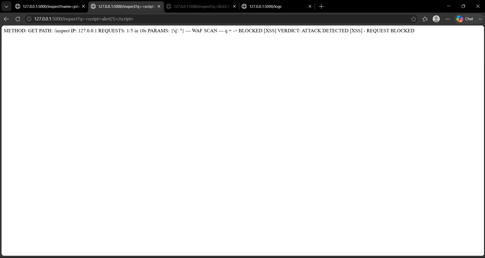

# SentinelShield: Advanced Intrusion Detection & Web Protection System

A signature-based Web Application Firewall (WAF) and lightweight Intrusion Detection System (IDS), built entirely from first principles using **Python 3** and **Flask**.

SentinelShield inspects incoming HTTP requests through a layered pipeline — a sliding-window rate limiter, a regex-based pattern-matching engine covering four major attack categories, a persistent CSV audit log, and a live HTML dashboard — to detect and block common web application attacks in real time.

This project was built as a hands-on cybersecurity practical, with the explicit goal of understanding, at the code level, how attacks are detected and how defensive systems are engineered.

---

## Features

- **Signature-based attack detection** for:
  - SQL Injection
  - Cross-Site Scripting (XSS)
  - Local File Inclusion / Path Traversal (LFI)
  - Command Injection
- **IP-based sliding-window rate limiter** — blocks any client exceeding 5 requests within a 10-second window
- **Persistent CSV audit logging** — every allowed and blocked request is recorded with a timestamp, IP, method, path, action, attack type, and full parameter details
- **Live HTML dashboard** — real-time summary statistics, attack-type breakdown, and recent activity feed
- Zero external dependencies beyond Flask — no database, no cloud services, no paid tools

---

## Tech Stack

| Component | Technology |

| Language | Python 3 |
| Web Framework | Flask |
| Detection Engine | Python `re` (regular expressions) |
| Persistence | CSV (`csv` module) |
| Rate Limiting | In-memory sliding window (`collections.defaultdict`) |

---

## Project Structure

SentinelShield/
├── sentinelshield.py      # Main Flask application — all routes, rules, and logic
├── requirements.txt       # Python dependencies
├── .gitignore
├── LICENSE
├── README.md

> **Note:** `sentinel_log.csv`, the audit log file, is auto-generated the first time you run the app. It is intentionally excluded from this repository via `.gitignore`, since it fills up with your own local test data every time you run the project.

---

## Getting Started

### Prerequisites
- Python 3.8 or higher
- pip

### Installation

1. Clone the repository:
```bash
   git clone https://github.com/indrajeetdhondugade/SentinelShield.git
   cd SentinelShield
```

2. Install the dependencies:
```bash
   pip install flask
```

3. Run the application:
```bash
   python sentinelshield.py
```

4. The server will start at:
http://127.0.0.1:5000

---

## Usage

SentinelShield exposes four endpoints:

| Route | Description |
|---|---|
| `/` | Confirms the server is running |
| `/inspect` | Main inspection endpoint — submit query parameters here to be scanned |
| `/logs` | Displays the raw CSV audit log |
| `/dashboard` | Live analytics dashboard with attack statistics |

### Example: A clean request
http://127.0.0.1:5000/inspect?name=john
Returns an **ALLOWED** verdict.

### Example: A SQL Injection attempt
http://127.0.0.1:5000/inspect?q=<script>alert(1)</script>
Returns a **BLOCKED [XSS]** verdict.

### Example: Triggering the rate limiter
Send more than 5 requests to `/inspect` within 10 seconds from the same IP — the 6th request will return:

STATUS: BLOCKED - RATE LIMIT EXCEEDED
---

## How Detection Works

Each attack category is defined as a single regular expression, checked against every query parameter value on every request to `/inspect`:

```python
SQL_PATTERN = r"(union.*select|select.*from|insert.*into|drop.*table|or\s+'1'='1|--|;)"
XSS_PATTERN = r"(<script|</script>|javascript:|onerror=|onload=|alert\()"
LFI_PATTERN = r"(\.\./|/etc/passwd|/etc/shadow|php://filter|file://)"
CMD_PATTERN = r"(whoami|cat\s|ls\s|rm\s|wget\s|curl\s|;\s*\w|&&|\|\|)"
```

All rules are matched case-insensitively (`re.IGNORECASE`), so keyword casing cannot be used to bypass detection. Rules are stored declaratively in a single `RULES` list, so new attack categories can be added without changing any control-flow logic.

---

## Rate Limiting

The rate limiter uses a **sliding window**, not a fixed one — it recalculates the valid request count on every single request rather than resetting a counter at fixed intervals. This avoids the classic "burst at window boundary" exploit that fixed-window rate limiters are vulnerable to.

---

## Screenshots

**Project setup and server running**


**WAF rule engine — SQL Injection pattern and detection logic**


**Attack simulation — SQL Injection blocked**


**Attack simulation — XSS blocked**



**Rate limiter triggering a block on the 6th request**


**Live dashboard**


*(Additional screenshots covering every module and attack category are available in the [`/Screenshot`](./Screenshot) folder.)*

---

## Testing

SentinelShield was validated using a structured 40-case test suite covering all four attack categories, the rate limiter, the CSV logger, and dashboard accuracy. All 40 test cases passed with a 100% success rate.

---

## Scope and Limitations

This project is a **single-file, single-process educational implementation**, built to demonstrate WAF/IDS concepts clearly and transparently — it is not intended for production deployment. Specifically:

- Detection is signature-based only; it does not catch novel or heavily obfuscated attacks
- Only URL query parameters are inspected — POST bodies, cookies, and headers are currently out of scope
- Rate-limiter state and logs are held in memory/flat-file and are not designed for high-throughput or distributed use

See the full project report for a complete discussion of design decisions, testing methodology, and future enhancements.

---

## Future Enhancements

- POST body and JSON payload inspection
- Persistent IP blocklist for repeat offenders
- Migration from CSV to a lightweight database (SQLite) for faster querying
- Hybrid detection combining the current signature engine with a machine-learning anomaly detector

---

## License

This project is licensed under the MIT License — see the [LICENSE](./LICENSE) file for details.

---

## Author

**Indrajeet Dhondugade**
Built as a Cybersecurity Practical Project — Web Application Security domain.

update READme


└── Screenshot/             # Development and testing screenshots
